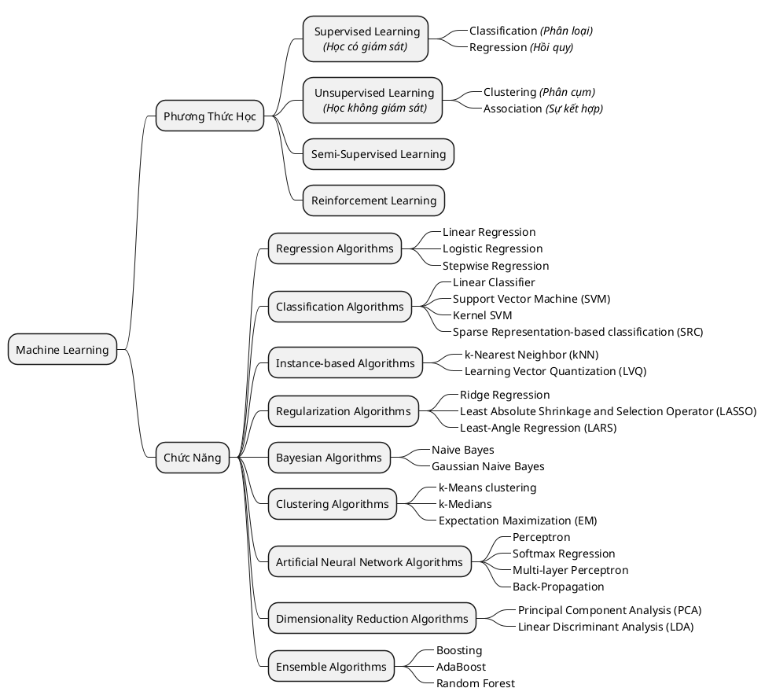

# Machine Learning

> __Machine Learning__ có nghĩa là học máy, hoặc học máy, tiền thân của AI, mình không rõ lắm.

## What

Theo định nghĩa của __*Wikipedia*__, _"**Machine learning** is the subfield of computer science that “gives computers the ability to learn without being explicitly programmed”_. Nói đơn giản, __Machine Learning__ là một lĩnh vực nhỏ của __Khoa Học Máy Tính__, nó có khả năng tự học hỏi dựa trên dữ liệu đưa vào mà không cần phải được lập trình cụ thể.

## MindMap

## Tham Khảo

- Tiến Sĩ __Vũ Hữu Tiệp__ biên soạn ra giáo trình này để tham khảo:
    - [Machine Learning](https://machinelearningcoban.com/2016/12/26/introduce/)

### Các khóa học

!!! note "Tiếng Anh"
    - [Machine Learning với thầy Andrew Ng trên Coursera (Khóa học nổi tiếng nhất về Machine Learning)](https://www.coursera.org/learn/machine-learning)
    - [Deep Learning by Google trên Udacity (Khóa học nâng cao hơn về Deep Learning với Tensorflow)](https://www.udacity.com/course/deep-learning--ud730)
    - [Machine Learning mastery (Các thuật toán Machine Learning cơ bản)](http://machinelearningmastery.com/)

!!! note "tiếng Việt"
    - [Machine Learning trong Xử Lý Ngôn Ngữ Tự Nhiên - Nhóm Đông Du Nhật Bản](http://viet.jnlp.org/kien-thuc-co-ban-ve-xu-ly-ngon-ngu-tu-nhien/machine-learning-trong-nlp)
    - [Machine Learning cho người mới bắt đầu - Ông Xuân Hồng JAIST.](https://ongxuanhong.wordpress.com/)
    - [Machine Learning book for Vietnamese - Nguyễn Xuân Khánh University of Maryland](https://khanh-personal.gitbook.io/ml-book-vn/)

