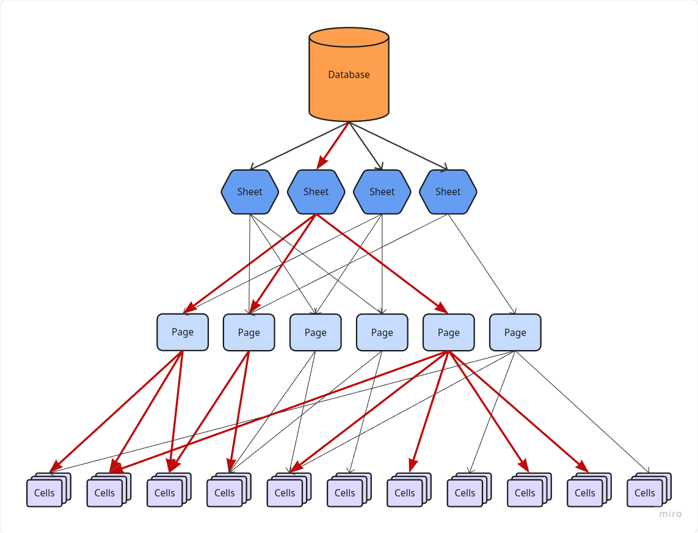

# \[Alg.\] Lock Hierarchy

__Lock Hierarchy__ - _Hệ Thống Phân Cấp Khóa_ - là chỉ cách thức phân bổ quyền truy cập vào các khu vực bộ nhớ.

## Giải Thích

Đây không hẳn là một dạng thuật toán, nhưng cũng có thể coi như vậy. Cách phát triển hệ thống này có thể bắt gặp trong các cơ sở dữ liệu như SQL hoặc MySQL, ...

Về mặt ngữ nghĩa, nó chia dữ liệu thành các lớp dữ liệu tương đồng có các cấp độ. Việc khóa một mảng dữ liệu sẽ có yêu cầu rằng

> Nếu đối tượng A đang khóa dữ liệu tại vị trí $N$ thì nó chỉ có thể khóa tiếp ở các vị trí thứ $N+1$ ??? Mình cũng không rõ nó đúng hay sai nữa.

## Temp. Code Mutex

Trong Mutex yêu cầu rằng nếu bạn khóa một lớp các Mutex theo thứ tự $A, B, C, D, ...$ thì lúc mở khóa cũng phải theo thứ tự đó đi ra. Thực sự đọc đến giờ tôi vẫn chưa liên hệ được điều đồ đó với biểu đồ phân bổ dữ liệu.

Ở ví dụ này mình sử dụng mô hình dữ liệu theo lớp đơn giản, với ý nghĩa và ngữ cảnh giống như dạng __Database__ cơ sở. Các lớp được phân bổ lần lượt là: __*Database/Sheet/Page/Cells*__

- __Database__: Coi như là dữ liệu tổng. __Database__ đại loại như một thực thể bao quát tất cả một khối cực lớn dữ liệu có phân cấp. Bắt đầu là với các __Sheet__
- __Sheet__: __Sheet__ tiếp tục phân cấp xuống thành các __Page__. Trong Sheet có thể chứa một hoặc nhiều __Page__
- __Page__: __Page__ gồm một __Cell__
- __Cells__: __Cell__ coi như một thực thể thực sự đi. Nó kiểu dạng như các dữ liệu `int`, `bool`, ... hoặc chuỗi các loại dữ liệu. Các __Cells__ tượng  trưng cho các giá trị dùng chung của nhiều tiến trình.

## Dữ Liệu Độc Lập

Ở dạng dữ liệu độc lập. Mình nghĩ để có được sự phân bổ này cần có sự cố gắng của người thiết kế. Các dữ liệu độc lập với nhau khi cập nhậo dữ liệu hiếm khi có sự chồng lớn.

Câu hỏi ở đâu là nếu khóa một Page có nê

- Các khóa thực thi ở các lớp Cell là riêng biệt

<figure markdown="span">
    
    <figcaption>Dạng dữ liệu thuẩn nhất, không chồng lấn</figcaption>
</figure>

<figure markdown="span">
    
    <figcaption>Dạng dữ liệu chồng lấn</figcaption>
</figure>