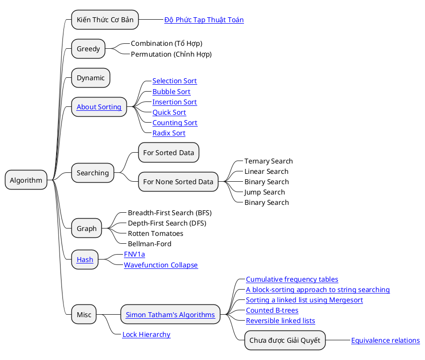

# Algorithm

```puml
@startmindmap
skinparam backgroundcolor transparent
!$URL = "/CS"

* Algorithm
** Kiến Thức Cơ Bản
***_ [[$URL/dev-algorithm-algorithmic-complexity/ Độ Phức Tạp Thuật Toán]]

** Greedy
***_ Combination (Tổ Hợp)
***_ Permutation (Chỉnh Hợp)

** Dynamic
** [[$URL/algorithm-sort/ About Sorting]]
***_ [[$URL/algorithm-selection-sort/ Selection Sort]]
***_ [[$URL/algorithm-bubble-sort/ Bubble Sort]]
***_ [[$URL/algorithm-insertion-sort/ Insertion Sort]]
***_ [[$URL/algorithm-quick-sort/ Quick Sort]]
***_ [[$URL/algorithm-counting-sort/ Counting Sort]]
***_ [[$URL/algorithm-radix-sort/ Radix Sort]]

** Searching
*** For Sorted Data
*** For None Sorted Data
****_ Ternary Search
****_ Linear Search
****_ Binary Search
****_ Jump Search
****_ Binary Search

** Graph
***_ Breadth-First Search (BFS)
***_ Depth-First Search (DFS)
***_ Rotten Tomatoes
***_ Bellman–Ford

** [[$URL/algorithm-hash/ Hash]]
***_ [[$URL/algorithm-hashing-fnv1a/ FNV1a]]
***_ [[$URL/wavefunction-collapse/ Wavefunction Collapse]]

** Misc
*** [[https://www.chiark.greenend.org.uk/~sgtatham/algorithms/ Simon Tatham's Algorithms]]
****_ [[https://www.chiark.greenend.org.uk/~sgtatham/algorithms/cumulative.html Cumulative frequency tables]]
****_ [[https://www.chiark.greenend.org.uk/~sgtatham/algorithms/blocksort.html A block-sorting approach to string searching]]
****_ [[https://www.chiark.greenend.org.uk/~sgtatham/algorithms/listsort.html Sorting a linked list using Mergesort]]
****_ [[https://www.chiark.greenend.org.uk/~sgtatham/algorithms/cbtree.html Counted B-trees]]
****_ [[https://www.chiark.greenend.org.uk/~sgtatham/algorithms/revlist.html Reversible linked lists]]
**** Chưa được Giải Quyết
*****_ [[https://www.chiark.greenend.org.uk/~sgtatham/algorithms/equivalence.html Equivalence relations]]
***_ [[$URL/algorithm-lock-hierarchy/ Lock Hierarchy]]
@endmindmap
```