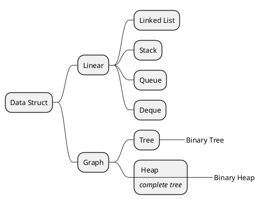

# Data Struct

```puml
@startmindmap
skinparam backgroundcolor transparent
* Data Struct
** Linear
*** Linked List
*** Stack
*** Queue
*** Deque
** Graph
*** Tree
****_ Binary Tree
***: Heap
----
//complete tree//;
****_ Binary Heap
@endmindmap
```