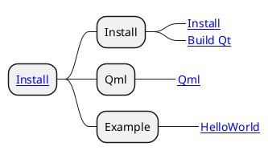

# Qt

## Giới thiệu về Qt
## Build

```puml
@startmindmap
skinparam backgroundcolor transparent
!$URL = "/Frameworks/Qt"

* [[$URL/qt/ Install]]
** Install
***_ [[$URL/qt-install/ Install]]
***_ [[$URL/qt-build/ Build Qt]]

** Qml
***_ [[$URL/qt-qml/ Qml]]

** Example
***_ [[$URL/qt-eg-hello-world/ HelloWorld]]

@endmindmap
```