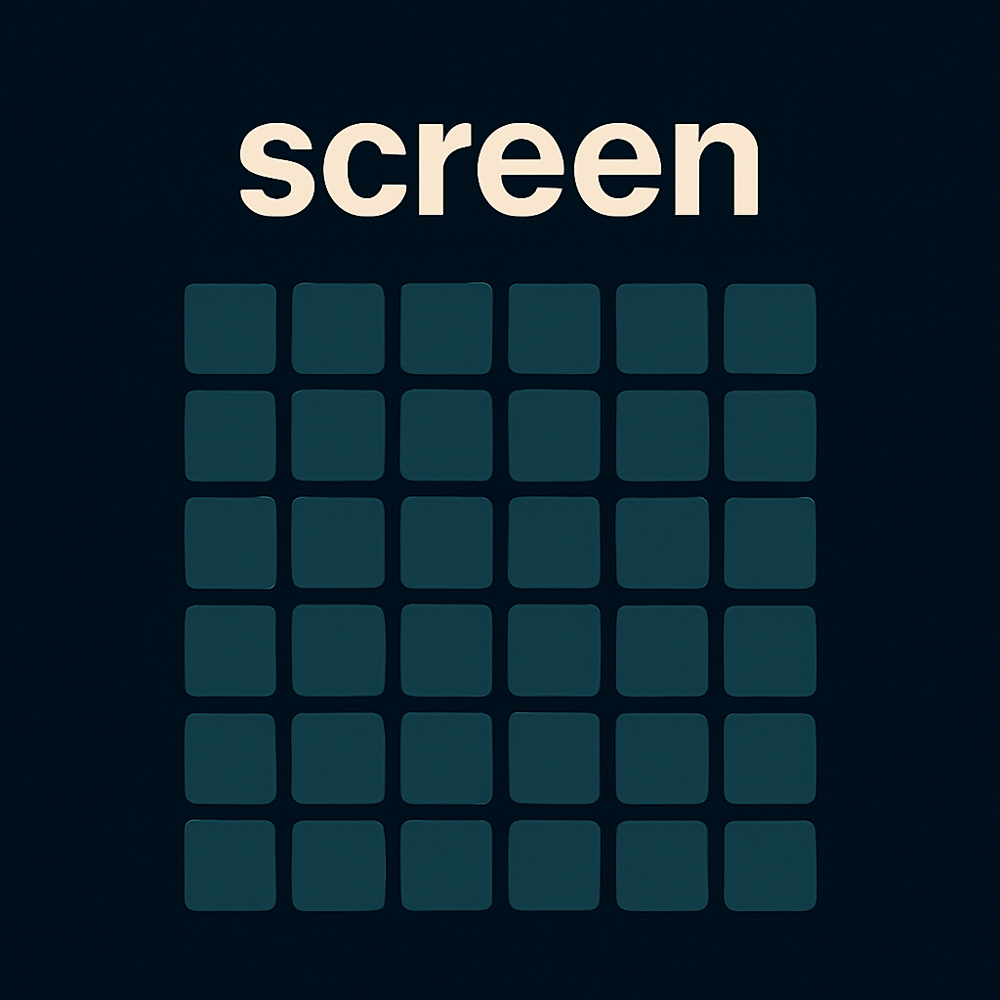

# FTXUI Screen

> [_Nguồn_](https://arthursonzogni.github.io/FTXUI/module-screen.html)

## Ví Dụ Trong Chương

```cpp title="Ví Dụ"
#include < ftxui/screen/screen.hpp >
#include < ftxui/screen/color.hpp >
 
void  main () {
    auto screen = ftxui::Screen::Create (
        ftxui::Dimension::Full(),    // Sử dụng toàn bộ chiều rộng của terminal
        ftxui::Dimension::Fixed(10) // Chiều cao cố định là 10 hàng
    );
 
    // Truy cập một pixel cụ thể tại tọa độ (10, 5)
    auto & pixel = screen.PixelAt(10, 5);
 
    // Thiết lập các thuộc tính của pixel.
    pixel.character = U 'X' ;
    pixel.foreground_color = ftxui::Color::Red ;
    pixel.background_color = ftxui::Color::RGB (0, 255, 0);
    pixel.bold = true ; // Đặt kiểu chữ đậm
    screen.Print(); // In màn hình ra terminal
}
```

## Cấu Trúc

### ftxui::Screen

Lớp `ftxui::Screen` đại diện cho một lưới 2D gồm các ký tự được định kiểu có thể được hiển thị trên thiết bị đầu cuối.

Nó cung cấp các phương thức để tạo màn hình, truy cập __*pixel*__ và hiển thị các phần tử.

<figure markdown="span">
    
    <figcaption>Cấu trúc của grid trên screen</figcaption>
</figure>

!!! note "Note"
    Nếu tọa độ nằm ngoài phạm vi cho phép, một pixel giả sẽ được trả về.