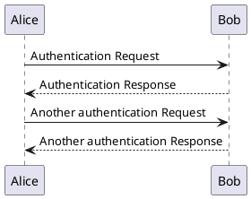
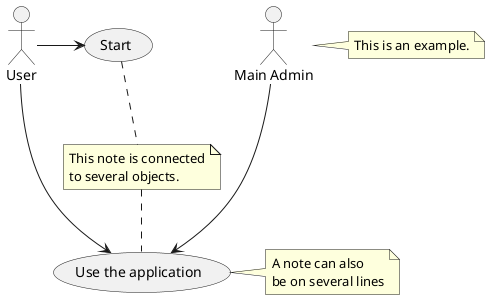
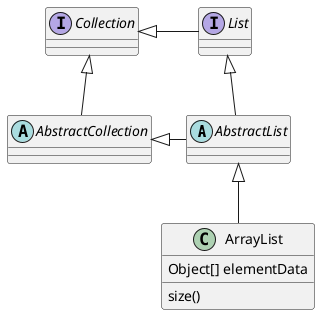
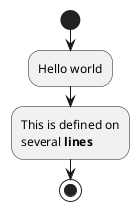

# \[PlantUml\]

## Giới thiệu

PlantUML là một công cụ rất linh hoạt tạo điều kiện tạo ra sự tạo ra nhanh chóng và đơn giản của một loạt các sơ đồ.

## Supported UML Diagrams

### [Sequence Diagram](./plantuml-sequence-diagram.md)

Sequence Diagram Example

### [Usecase diagram](./plantuml-usecase-diagram.md)

Usecase Diagram Example

### [Class diagram](./plantuml-class-diagram.md)

Class diagram Example

### [Object diagram](./plantuml-object-diagram.md)

### [Activity diagram](./plantuml-activity-diagram.md)

Activity Diagram Example

### [Component diagram](./plantuml-component-diagram.md)

### [Deployment diagram](./plantuml-deployment-diagram.md)

### [State diagram](./plantuml-state-diagram.md)

### [Timing diagram](./plantuml-timing-diagram.md)