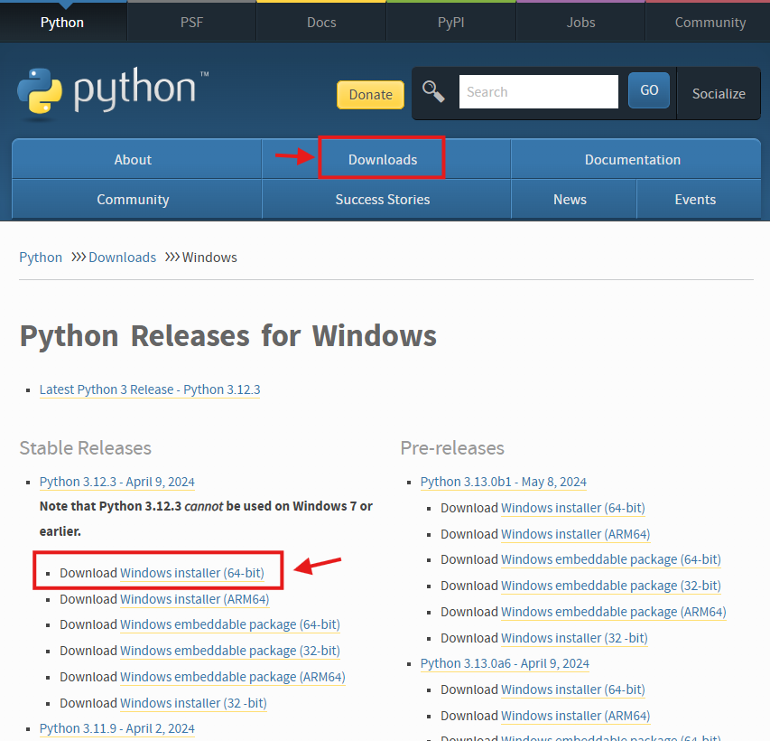
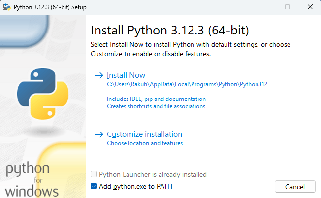
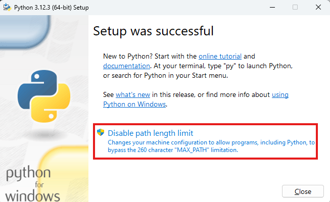

# \[Python\] Cài đặt cho Windows

## Tải về cài đặt

Tải về cài đặt Python trực tiếp từ [trang chủ](https://www.python.org/).

<figure markdown="span">
        
    <figcaption>Tải về gói cài đặt trên tmrang chủ Python</figcaption>
</figure>


Sau đó chỉ cần cài đặt. Ở bước này nếu không thông thạo thì không cần nghĩ, phần mềm bảo gì thì cứ ấn __Next__ là được _(đồng ý tất cả)_. Dù sao đây cũng là phần mềm dành cho dân lập trình, không có gì kỳ lạ bị cài thêm đâu.

Chú ý gần cuối sẽ có lựa chọn `Add python.exe to PATH` để có thể dùng các lệnh python ở `command console (cmd)`.

<figure markdown="span">
    
    <figcaption>Lựa chọn cho PATH</figcaption>
</figure>

Nếu không muốn gặp vấn đề với đường dẫn thì nên chọn lựa chọn này! Chủ yếu hệ thông Windows thi thoảng sẽ có đường dẫn rất rất dài do windows không hạn chế về _(dir-length + filename-length)_ dựa trên số lượng `ascii` mà trên `số lượng ký tự`.

Điều này nếu không mở ra có thể chạy code python sẽ lỗi. Còn nếu có thể bỏ được thì cũng tốt nếu bạn tự tin và khả năng quản lý và xử lý lỗi của mình.

<figure markdown="span">
    
    <figcaption></figcaption>
</figure>

Vậy là xong!


## Kiểm tra python

Kiểm tra __Python__ đã có chưa trên __Windows__ bằng lệnh sau _(nếu ở bước trên đồng ý add Python to PATH)_:

```text
python -V
```

Thông thường sẽ có kết quả trả về là phiên bản được cài đặt. Nếu không có bạn cũng có thể tự thêm đường dẫn vào __PATH__. Đường dẫn mặc định sẽ có dạng như này:

```text
C:\Users\Rakuh\AppData\Local\Programs\Python\Python313
```

!!! warning "Warning"
    - __Python313__ là ví dụ, thay nó bằng phiên bản bạn cài đặt hoặc sử dụng chính.
    - Hoặc đơn giản hơn là vào thư mục trước đó và tìm đúng thư mục.

## Kiểm tra pip

Tiện thể kiểm tra `pip`, một chương trình quản lý các gói cài đặt dành cho __Python__ bằng lệnh:

```text
pip -V
```

Nếu không có, tương tự, bạn có thể tìm trong đường dẫn dưới dây:

```text
C:\Users\Rakuh\AppData\Local\Programs\Python\Python313\Scripts
```

!!! warning "Warning"
    - __Python313__ là ví dụ, thay nó bằng phiên bản bạn cài đặt hoặc sử dụng chính.
    - Hoặc đơn giản hơn là vào thư mục trước đó và tìm đúng thư mục.