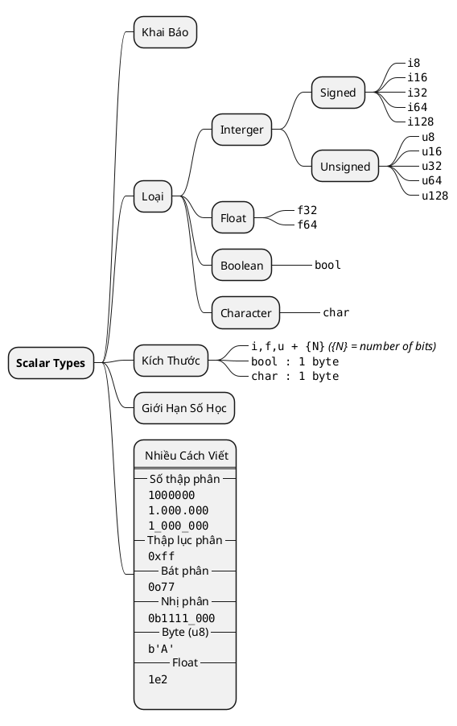

# \[Rust\] Scalar

> Thuộc kiểu __Biến Nguyên Thủy__, đòng đơn hướng.

## Định Nghĩa

- __Scalar Types__ ý chỉ những kiểu dữ liệu đơn nhất, chỉ chứa một __*dạng giá trị đơn nhất*__
- Các kiểu __Biến Đơn Hướng__ trong __Rust__ chính là các kiểu biến nguyên thuỷ được hỗ trợ bởi các ngôn ngữ bậc thấp hơn. Cụ thể là các kiểu như số __*tự nhiên*__, __*số thực*__, __*boolean*__ _(logic so sánh)_ và kiểu __*ký tự*__ _(char)_ cái mà hầu hết các ngôn ngữ lập trình bậc cao đề chắc chắn sẽ hỗ trợ.
- __*Rust*__ không sử dụng ngầm định cho boolean là các kiểu số học _(`true = 1` và `false = 0`)_. Các kiểu boolean dùng để _điều khiển luồng và logic_ không giống số tự nhiên.

## Tóm Tắt



## Khai Báo

Khai báo kiểu có thể sử dụng khai báo trước hoặc sau:

```rust
let x:u32 = 10;
let y = 10u32;
```

> Cả hai cách trên đều hợp lệ.
> - Cách 1 khai báo kiểu `u32` cho biến __x__
> - Cách 2 khai báo kiểu `u32` cho giá trị `10`. Lúc này giá trị của biến bị ép sang kiểu của biến.

## Kích Thước

Kích thước các kiểu đơn hướng như sau:

|                   | 1 byte | 2 byte | 4 byte | 8 byte | 16 byte |
| :---------------- | :----: | :----: | :----: | :----: | :-----: |
| Interger          |  `i8`  | `i16`  | `i32`  | `i64`  | `i128`  |
| Unsigned Interger |  `u8`  | `u16`  | `u32`  | `u64`  | `u128`  |
| Float             |        |        | `f32`  | `f64`  |         |
| Boolean           | `bool` |        |        |        |         |
| Character         |        |        | `char` |        |         |

- Ngoài các số nguyên kể trên còn có hai loại là `isize` và `usize`. Hai kiểu này không có kích thước cụ thể mà nó sẽ phụ thuộc vào kiến trúc vi xử lý _(`64-bit` hoặc `32-bit`)_
- Các số thực được sử dụng theo chuẩn __IEEE-754__, nghĩa __*số thập phân luôn là số có dấu*__.
- <mark>Kiểu ký tự trong Rust được mở rộng lên _4 bytes_</mark>, cho phép nó hiển thị được nhiều ký tự hơn so với bảng mã __ASCII__ thông thường.
- Ký tự trong __Rust__ yêu cầu khai báo trong dấu `'`, dấu `"` không chấp nhận.

## Giới Hạn Số Học

Cũng như các loại giá trị khác, thường __Số Nguyên Có Dấu__ sẽ có khoảng giá trị từ $[(-2^{N-1}) \to (2^{N-1}-1)]$, với $N$ là số `bits` mà biến đó có thể sử dụng. Ví dụ với `i32` (thường sử dụng nhất) sẽ có khoảng giá trị là $[(-2^{31}) \to (2^{31}-1)]$ hay cụ thể là từ $[-2,147,483,647 \to 2,147,483,646]$.

Với __Số Nguyên Không Dấu__, khoảng giá trị được mở rộng lên $[0 \to 2^{N}-1]$. Đại biểu với `u32` sẽ là $[0 \to 4,294,967,295]$

## Cách Viết Khác

Ngoài việc có thể khai báo trực tiếp, các số nguyên còn có thể <mark>khai báo ở nhiều dạng khác</mark>. Các kiểu khai báo khác nhau phần lớn để hỗ trợ lập trình viên đọc và xử lý các só lớn khi mà nếu để chúng viết liền như cũ cực kỳ khó để đọc. Ví dụ như `1000000000` và `1.000.000.000`. Dưới đây là một số cách viết:

| Chữ số                         | Ví dụ         | Ví dụ                                                           |
| :----------------------------- | :------------ | :-------------------------------------------------------------- |
| Số thập phân                   | `98_222`      | *Các chữ số có thể dùng dấu _ để phân cách khi viết các số lớn* |
| Thập lục phân                  | `0xff`        |                                                                 |
| bát phân                       | `0o77`        |                                                                 |
| nhị phân                       | `0b1111_0000` |                                                                 |
| Byte _(chỉ cho phép với `u8`)_ | `b'A'`        |                                                                 |
| Float                          | `1e2`         |                                                                 |

```rust title="Ví dụ"
let x:i64 = 100_000_000_000; // 100000000000
```