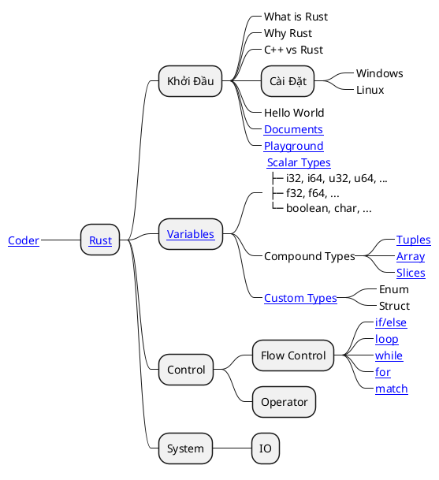

# \[Rust\] About Rust

Rust là một ngôn ngữ lập trình hệ thống hiện đại tập trung vào __tính an toàn__, __tốc độ__ và __tính đồng thời__. Ngôn ngữ này đạt được những mục tiêu này nhờ __*tính bảo mật bộ nhớ*__ mà không cần sử dụng cơ chế thu gom rác.

Rust mạnh mẽ nhất trong việc tạo ra các mã đơn giản mà an toàn. Hầu hết là nhờ bộ __quy tắc lặp trình chặt chẽ__ được sử dụng trong trình biên dịch. Mặc dù đã cố gắng áp dụng các __khái niệm tiên tiến__ mà an toàn từ những ngôn ngữ bậc cao như _tự động xác định kiểu biến an toàn_, nhưng dù vậy __*Rust*__ vẫn

- Khó học
- Build chậm
- Khó tiếp cận, cần có kiến thức đa điều từ cả ngôn ngữ lập trình lẫn kiến thức hệ thống.
- Không có nhiều các plugin hỗ trợ hoặc một tập đoàn hỗ trợ mạnh mẽ như __Kotlin__ của __Google__

## Roadmap

