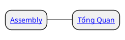

# Hợp Ngữ

```puml
@startmindmap
skinparam backgroundcolor transparent
!$URL = "/Programming/assembly"

* [[  Assembly]]
** [[$URL/assembly-overview Tổng Quan]]
@endmindmap
```

<!-- TODO -->

- Cấu trúc dòng lệnh `[Tên lệnh] [Đích], [Nguồn]`
