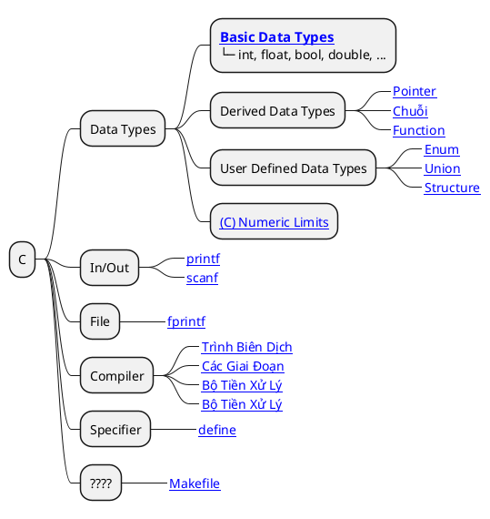

# \[C\] About C Language

- Ngôn ngữ này nhanh.
- C rất phổ biến từ những thập kỷ trước bởi tính tiện dụng và ổn định.
- Có thể nói đây là một trong những ngôn ngữ thành công nhất.

```puml
@startmindmap
skinparam backgroundcolor transparent
!$URL = "http://localhost:65001/Programming/c"

* C
** Data Types
***:=== [[$URL/c-basic-data-types/ Basic Data Types]]
└─ int, float, bool, double, ...;
*** Derived Data Types
****_ [[$URL/c-pointer/ Pointer]]
****_ [[$URL/c-array/ Chuỗi]]
****_ [[$URL/c-function/ Function]]
*** User Defined Data Types
****_ [[$URL/c-enum Enum]]
****_ [[$URL/c-union Union]]
****_ [[$URL/c-struct Structure]]
*** [[$URL/c-numeric-limits/ (C) Numeric Limits]]
** In/Out
***_ [[$URL/c-printf/ printf]]
***_ [[$URL/c-scanf/ scanf]]
** File
***_ [[/$URLc-fprintf/ fprintf]]
** Compiler
***_ [[$URL/c-compiler/ Trình Biên Dịch]]
***_ [[$URL/c-translation-phases/ Các Giai Đoạn]]
***_ [[$URL/c-preprocessor/ Bộ Tiền Xử Lý]]
***_ [[$URL/c-replacing-text-macros/ Bộ Tiền Xử Lý]]
** Specifier
***_ [[$URL/c-define/ define]]
** ????
***_ [[/$URLc-makefile/ Makefile]]
@endmindmap
```