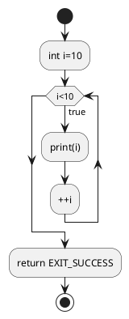
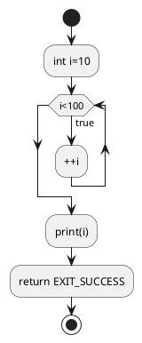

# \[C++\] Vòng lặp

## Vòng lặp

<u>__Vòng lặp điều kiện__</u> và <u>__Vòng lặp trong khoảng__</u>

### Vòng lặp trong khoảng

- Vòng lặp trong khoảng là `for`. Vòng lặp sẽ kết thúc với điều kiện theo biến đầu `i`.
	- `int i=0;` : Biến `i` khởi tạo bắt đầu từ giá trị `0`
	- `i<10;`: Điều kiện thoát là nhỏ hơn `10`
	- `++i`: Tăng thêm một giá trị sau khi hết vòng lặp
	- Chương trình chính thực hiện trong `{}`
```c++ title="main.cpp"
int main()
{
	for(int i=0; i<10; ++i) {
		std::cout << i << std::endl;
	}
	return EXIT_SUCCESS; 
}
```
```txt
0
1
2
3
4
5
6
7
8
9
```

Tiến trình vòng lặp __FOR__ như sau:



### Vòng lặp điều kiện

<u>__Vòng lặp điều kiện__</u> sử dụng cú pháp `while` và thoát chỉ với 1 điều kiện. Cho đến khi nào điều kiện chưa được thoả mãn thì còn trong vòng lặp `{}`.

```c++ title="main.cpp"
int main()
{
	int i=0;
	while(i<100) {
		// Do code in here
		++i;
	}
	std::cout << i << std::endl;
	return EXIT_SUCCESS; 
}
```

Chương trình thoát với điều kiện cho đến khi biến `i` đến giá trị `100`

```txt
100
```

Vòng lặp có sơ đồ như sau:



<u>__Vòng lặp điều kiện__</u> cũng có thể được sử dụng cùng chức năng với `for` như sau:

```c++ title="main.cpp"
int main()
{
	int i=0;
	for(;i<100;;) {
		// Do code in here
		++i;
	}
	std::cout << i << std::endl;
	return EXIT_SUCCESS; 
}
```