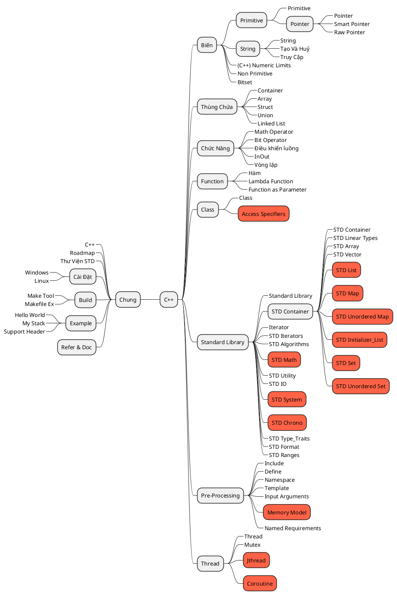

# \[C++\] Roadmap

> Cuối cùng mình cũng phải từ bỏ để làm cái này. Bảng này phân bổ lại các kiến thức và ghi chú lại các kiến thức rời rạc cái mà mình có ý định học và sẽ học.

```puml
@startmindmap
* C++

left side
 * Chung
  *_ C++
  *_ Roadmap
  *_ Thư Viện STD
  * Cài Đặt
   *_ Windows
   *_ Linux
  * Build
   *_ Make Tool
   *_ Makefile Ex
  * Example
   *_ Hello World
   *_ My Stack
   *_ Support Header
  * Refer & Doc

right side
 * Biến
  * Primitive
   *_ Primitive
   * Pointer
    *_ Pointer
    *_ Smart Pointer
    *_ Raw Pointer
  * String
   *_ String
   *_ Tạo Và Huỷ
   *_ Truy Cập
  *_ (C++) Numeric Limits
  *_ Non Primitive
  *_ Bitset
 * Thùng Chứa
  *_ Container
  *_ Array
  *_ Struct
  *_ Union
  *_ Linked List
 * Chức Năng
  *_ Math Operator
  *_ Bit Operator
  *_ Điều khiển luồng
  *_ InOut
  *_ Vòng lặp
 * Function
  *_ Hàm
  *_ Lambda Function
  *_ Function as Parameter
 * Class
  *_ Class
  *[#tomato] Access Specifiers
 * Standard Library
  *_ Standard Library
  * STD Container
   *_ STD Container
   *_ STD Linear Types
   *_ STD Array
   *_ STD Vector
   *[#tomato] STD List
   *[#tomato] STD Map
   *[#tomato] STD Unordered Map
   *[#tomato] STD Initializer_List
   *[#tomato] STD Set
   *[#tomato] STD Unordered Set
  *_ Iterator
  *_ STD Iterators
  *_ STD Algorithms
  *[#tomato] STD Math
  *_ STD Utility
  *_ STD IO
  *[#tomato] STD System
  *[#tomato] STD Chrono
  *_ STD Type_Traits
  *_ STD Format
  *_ STD Ranges
 * Pre-Processing
  *_ Include
  *_ Define
  *_ Namespace
  *_ Template
  *_ Input Arguments
  *[#tomato] Memory Model
  *_ Named Requirements
 * Thread
  *_ Thread
  *_ Mutex
  *[#tomato] Jthread
  *[#tomato] Coroutine
@endmindmap
```