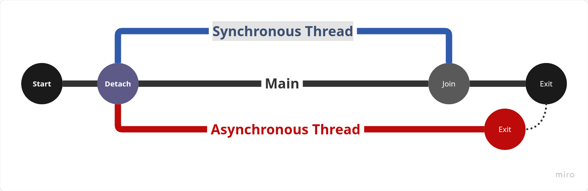

# Thread

Đa luồng trong __C++__.

## Đa Luồng

- Đa luồng sử dụng thư viện `<thread>`
- Luồng được tạo khi khai báo `std::thread __name(__function)`
    - `__name`: Tên biến
    - `__function`: Hàm thực thi của luồng.
- Các luồng con sử dụng tiến trình khác biệt, nhưng chia sẻ chung không gian bộ nhớ với __*main*__ (PID)
- Bất kể luồng con nào xảy ra lỗi khiến chương trình kết thúc, __*(crash)*__ gây sập trên toàn bộ hệ thống.
- __Synchronous Thread__
    - Luồng đồng bộ, thực hiện ở một luồng riêng nhưng ở _main thread_ vẫn có quyền chi phối.
    - Có một tiến trình `join()` để trở lại _main_ khi luồng kết thúc.
- __Asynchronous Thread__
    - Luồng Bất Đồng Bộ, xảy ra khi thread gọi `detach()`
    - Sau đó luồng sẽ rời khỏi sự quản lý của __*main thread*__, hoàn toàn độc lập.

<figure markdown="span">
    
    <figcaption></figcaption>
</figure>

## Khởi Tạo

- Một luồng - __*thread*__ được tạo ra bằng công thức: `std::thread __name(__function__)`.
- Sau khi được khởi tạo, luồng sẽ tự động thực thi hàm được khai báo trong luồng.

## Synchronous Thread
> Luồng Đồng Bộ

- Luồng đồng bộ là luồng sau khi khởi tạo không gọi __*detach()*__, nói đơn giản hơn khi bạn khởi tạo luồng với `std::thread __thread(task)`, nó sẽ là luồng đồng bộ.
- Luồng đồng bộ chịu sự chi phối của biến nơi tạo ra luồng `std::thread __thread(task)`.
- Luồng đồng bộ luôn cần dùng `join()` để hệ điều hành thực hiện nhiệm vụ giải phóng bộ nhớ của luồng.

Xảy xem trước với ví dụ đơn giản sau:

```cpp
#include <iostream>
#include <thread>
#include <unistd.h>

void task() {
    // do something
    sleep(1);
}

int main() {
    std::thread thread_0(task);
    thread_0.join();
    return 0; 
}
```

### join

- Ở ví dụ trên, luồng chỉ đơn giản được khởi tạo. Trong luồng không làm gì chả chỉ chờ trong 1 giây và thoát.
- Nếu không gọi hàm __join()__, chương trình sẽ kết thúc ở `main()` và xảy ra lỗi.
    ```text title="Lỗi không gọi join"
    terminate called without an active exception
    Aborted
    ```
    - Lỗi này xảy ra do khi `main()` kết thúc, vì thread không được xử lý __*join()*__
    - Khi kết thúc thì dữ liệu của `std::thread thread_0(task);` bị giải phóng khỏi __*stack*__. `thread_0` trực tiếp gọi đến hàm hủy trong khi luồng đang thực thi. Điều này gây lỗi.
- Trong trường hợp gọi `join()` mà luồng chưa thực hiện xong, luồng đó sẽ bị dừng lại để đợi luồng con thực hiện xong mới thoát chương trình.
- Gọi hai lần `join()` thì chương trình cũng chết với lỗi là __Invalid argument__, do bộ nhớ đã giải phóng và không thể truy cập lại.

!!! danger "Ghi nhớ"
    Thực tế ngay cả hoạt động trong luồng đã kết thúc trước khi hàm main kết thúc, luồng đồng bộ cũng không __*tự giải phóng bộ nhớ*__. Có thể thử ngược lại với hàm main đặt chờ `sleep(1)` và thread không hoạt có hành động nào cả. Lúc đó khi thoát chương trình lỗi vẫn sẽ xuất hiện.
    
    ```cpp
    #include <iostream>
    #include <thread>
    #include <unistd.h>

    void task() {
        // do something
    }

    int main() {
        std::thread thread_0(task);
        sleep(1);
        return 0; 
    }
    ```
    ```text
    terminate called without an active exception
    Aborted
    ```
    - Thực tế sau khi kết thúc, luồng đồng bộ vẫn ở trạng thái chờ và tiếp tục đợi cuộc gọi đến `join()` để bộ nhớ có thể được giải phóng.

### joinable

`joinable()` cho biết luồng đó có sẵn sàng cho hành động `join()` hay không. Giải pháp an toàn ở đây là:

```cpp
if(thread_0.joinable()) {
    thread_0.join();
}
```

Tại sao lại cần __*joinable()*__? Bởi vì trong chương trình có logic luồng phức tạp có rất nhiều trường hợp việc gọi trực tiếp đến __*join()*__ sẽ gây chết chương trình. Các trường hợp khiến __*joinable()*__ trả về `false` như sau:

- Khởi tạo luồng nhưng chưa gán hàm thực thi, luồng vẫn chưa hoạt động.
- Hành động `join()` đã được thực hiện trước đó rồi.
- Luồng đã được `detach()` và không còn trong quyền kiểm soát nữa.

## Ví Dụ

### Ví Dụ Luồng Đồng Bộ

- Ví dụ dưới đây cho thấy sự hoạt động của hai luồng con trong một luồng chính.
- Luồng chính hoạt động sau mỗi 0.5 giây, các luồng con là một giây.
- Sau khi kết thúc hoạt động, luồng chính sẽ chờ tại __join()__ cho đến khi luồng kết thúc mới kết thúc chương trình.

```cpp
#include <cstdio>
#include <iostream>
#include <vector>
#include <thread>
#include <unistd.h>

template <typename... Args>
void println(Args... args) {
    (std::cout << ... << args) << std::endl; // C++17 Fold Expression
}

void task() {
    int cnt{10};
    while (cnt --> 0) {
        sleep(1);
        println("[task][", std::this_thread::get_id(), "] count down ", cnt);
    }
}

int main() {
    std::thread t1(task);
    std::thread t2(task);

    // Get thread IDs
    std::cout << "t1 ID: " << t1.get_id() << std::endl;
    std::cout << "t2 ID: " << t2.get_id() << std::endl;

    int cnt{10};

    while (cnt --> 0) {
        usleep(500000);
        println("[main][", std::this_thread::get_id(), "] count down ", cnt);
    }

    // Wait thread done.
    t1.join();
    t2.join();

    return 0;
}
```
```text title="Kết Quả"
t1 ID: 130044710090432
t2 ID: 130044701697728
[main][130044717029184] count down 9
[task][[task][130044701697728130044710090432] count down ] count down 99

[main][130044717029184] count down 8
[main][130044717029184] count down 7
[task][[task][130044701697728] count down 1300447100904328] count down 
8
[main][130044717029184] count down 6
[main][130044717029184] count down 5
[task][[task][130044710090432130044701697728] count down ] count down 77

[main][130044717029184] count down 4
[main][130044717029184] count down 3
[task][[task][130044710090432130044701697728] count down ] count down 66

[main][130044717029184] count down 2
[main][130044717029184] count down 1
[task][[task][130044701697728130044710090432] count down ] count down 55

[main][130044717029184] count down 0
[task][[task][130044701697728130044710090432] count down ] count down 44

[task][[task][130044701697728] count down 130044710090432] count down 33

[task][[task][130044710090432130044701697728] count down ] count down 22

[task][130044701697728] count down 1
[task][130044710090432] count down 1
[task][[task][130044710090432130044701697728] count down ] count down 00
```

Dễ thấy, các hàm in ra không có sự đồng bộ, các tiến trình được xen lận

## Asynchronous Thread
> Luồng Bất Đồng Bộ

- Luồng không đồng bộ là luồng được tách hoàn toàn khỏi __*main*__, hàm thực hiện việc đó là hàm __*detach()*__
- Qua việc __*detach()*__ luồng, luồng main sẽ không còn có thể chờ luồng thực thi và đồng bộ lại nữa. Tức là khi này __join()__ sẽ không còn tác dụng.
- Cách này không được khuyến nghị, bởi việc này nên khi thoát chương trình, toàn bộ dữ liệu từ luồng khi __*detach()*__ sẽ không được giải phóng.
- Nếu luồng này thực hiện sớm và kết thúc sớm hơn main sẽ không sao, nhưng nếu luồng kết thúc muộn hơn __*main()*__ hoặc __*main()*__ bị ép kết thúc sớm, bộ nhớ sẽ bị rò rỉ. Tài nguyên tại các luồng con được __*detach()*__ sẽ bị giải phóng tuần tự theo __Stack__. Tại điểm không thể giải quyết, bộ nhớ sẽ treo gây hiện tượng rò rỉ bộ nhớ.
- Thế nên để an toàn, nếu thực sự cần __*detach()*__, luồng này nên hoạt động như một __*daemon*__ _(tác vụ nền)_ độc lập. Các tài nguyên sẽ được sao chép lại và sử dụng độc lập so với tác vụ chính.
- Sau khi __*detach()*__, __*thread*__ sẽ mất quyền kiểm soát và việc hủy, trừ nó rất rất nguy hiểm.

=== "Detach After"
    ```cpp
    #include <cstdio>
    #include <iostream>
    #include <vector>
    #include <thread>
    #include <unistd.h>

    template <typename... Args>
    void println(Args... args) {
        (std::cout << ... << args) << std::endl; // C++17 Fold Expression
    }

    void task() {
        int cnt = 10;
        while (cnt --> 0) {
            usleep(100);
            println("[task][", std::this_thread::get_id(), "] count down ", cnt);
        }
    }

    int main() {
        std::thread t1(task);
        std::thread t2(task);
        
        // Get thread IDs
        std::cout << "t1 ID: " << t1.get_id() << std::endl;
        std::cout << "t2 ID: " << t2.get_id() << std::endl;
        t1.detach();
        t2.detach();

        int cnt{10};
        while (cnt --> 0) {
            println("[main][", std::this_thread::get_id(), "] count down ", cnt);
        }

        println("End Main!");
        return 0;
    }
    ```
    ```text title="Kết Quả"
    t1 ID: 139057290016448
    t2 ID: 139057281623744
    [main][139057297254208] count down 9
    [main][139057297254208] count down 8
    [main][139057297254208] count down 7
    [main][139057297254208] count down 6
    [main][139057297254208] count down 5
    [main][139057297254208] count down 4
    [main][139057297254208] count down 3
    [main][139057297254208] count down 2
    [main][139057297254208] count down 1
    [main][139057297254208] count down 0
    End Main!
    ```
=== "Detach Before"
    ```cpp
    #include <cstdio>
    #include <iostream>
    #include <vector>
    #include <thread>
    #include <unistd.h>

    template <typename... Args>
    void println(Args... args) {
        (std::cout << ... << args) << std::endl; // C++17 Fold Expression
    }

    void task() {
        int cnt = 10;
        while (cnt --> 0) {
            usleep(100);
            println("[task][", std::this_thread::get_id(), "] count down ", cnt);
        }
    }

    int main() {
        std::thread t1(task);
        std::thread t2(task);
        
        // Get thread IDs
        std::cout << "t1 ID: " << t1.get_id() << std::endl;
        std::cout << "t2 ID: " << t2.get_id() << std::endl;
        t1.detach();
        t2.detach();

        int cnt{10};
        while (cnt --> 0) {
            println("[main][", std::this_thread::get_id(), "] count down ", cnt);
        }

        println("End Main!");
        return 0;
    }
    ```
    ```text title="Kết Quả"
    t1 ID: thread::id of a non-executing thread
    t2 ID: thread::id of a non-executing thread
    [main][136640126654272] count down 9
    [main][136640126654272] count down 8
    [main][136640126654272] count down 7
    [main][136640126654272] count down 6
    [main][136640126654272] count down 5
    [main][136640126654272] count down 4
    [main][136640126654272] count down 3
    [main][136640126654272] count down 2
    [main][136640126654272] count down 1
    [main][136640126654272] count down 0
    End Main!
    ```
## Truyền tham số

Có thể truyền tham số vào cho __*thread*__. Giải sử hàm truyền vào nhận tham số là như này.

```cpp
void task(int id) {
    int cnt = 10;
    while (cnt --> 0) {
        sleep(1);
        println("[thread ",id,"] count down ", cnt);
    }
}
```

Thì khi khai báo tạo __*thread*__ có thể đưa vào tham số như này.

```cpp
std::thread t1(task, 1);
std::thread t2(task, 2);
```
```text title="Kết Quả"
[thread 1] count down 1
[thread 2] count down 1
```

## Tiếp Theo

- [An toàn luồng với Mutex](cpp-std-mutex.md)
- [Luồng tự động an toàn std::jthread](cpp-std-jthread.md)