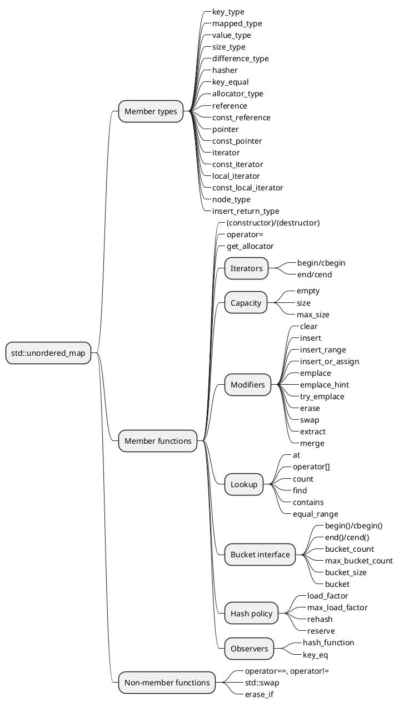

# Unordered Map

> https://en.cppreference.com/w/cpp/container/unordered_map.html

`std::unordered_map` là một _container_ liên kết chứa các cặp khóa-giá trị với các khóa duy nhất. Việc tìm kiếm, chèn và xóa các phần tử có độ phức tạp thời gian trung bình là hằng số.

Về mặt cấu trúc bên trong, các phần tử không được sắp xếp theo bất kỳ thứ tự cụ thể nào, mà được tổ chức thành các nhóm (bucket). Phần tử nào được đặt vào nhóm nào hoàn toàn phụ thuộc vào mã băm (hash) của khóa chứa nó. Các khóa có cùng mã băm sẽ xuất hiện trong cùng một nhóm. Điều này cho phép truy cập nhanh vào từng phần tử, vì sau khi mã băm được tính toán, nó sẽ tham chiếu đến nhóm chứa phần tử đó.

Hai khóa được coi là tương đương nếu điều kiện so sánh bằng khóa của map trả về true khi được truyền vào các khóa đó. Nếu hai khóa tương đương, hàm băm phải trả về cùng một giá trị cho cả hai khóa.

`std::unordered_map` đáp ứng các yêu cầu của __*Container*__, __*AllocatorAwareContainer*__, __*UnorderedAssociativeContainer*__.

!!! warning "Warning"
    - Vì thuật toán băm cơ bản không hoạt động với các dạng dữ liệu phức tạp, do đó chỉ có các [dữ liệu kiểu cơ bản](cpp-fundamental-datatypes.md) mới có thể sử dụng.

## Construct _(Xây Dựng)_

```cpp
// default constructor: empty map
std::unordered_map<std::string, std::string> m1;

// list constructor
std::unordered_map<int, std::string> m2 =
{
    {1, "foo"},
    {3, "bar"},
    {2, "baz"}
};
```

### Copy Constructor

```cpp
std::unordered_map<int, std::string> m3 = m2;
```
 
### Move Constructor

```cpp
std::unordered_map<int, std::string> m4 = std::move(m2);
```
 
### Range Constructor

Tái tạo lại bản đồ dựa trên 

```cpp
std::vector<std::pair<std::bitset<8>, int>> v = {{0x12, 1}, {0x01,-1}};
std::unordered_map<std::bitset<8>, double> m5(v.begin(), v.end());
```

## Thành Viên



## Duyệt Phần Tử

```cpp
std::unordered_map<int, float> umap;
for(auto ir : umap) {
    println("(first, second) = (", ir.first, ", ", ir.second, ")");
}
```

## Truy Vấn

- `umap.size()`: trả về số lượng phần tử.
- `umap.size()`: trả về số lượng phần tử.

## Truy cập phần tử