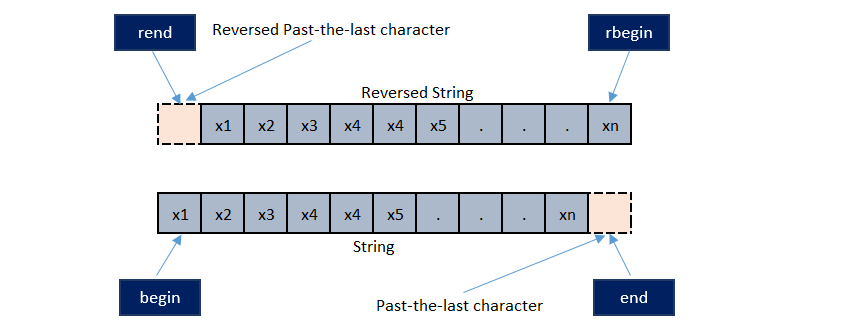

# \[C++\] Vector

`std::vector` là một dạng __*mảng động một chiều*__. Đây là cấu trúc dữ liệu quan trọng trong lập trình cạnh tranh nói riêng và lập trình nói chung.

`std::vector` mạnh nhất nhờ cấu trúc mảng giống như __mảng tĩnh__ khiến cho khả năng truy cập đến bộ nhớ tiệm cận $O(1)$ là nhanh nhất so với cấu trúc phân tán của `std::list`. Khi mới học sẽ dễ thấy hai kiến trúc này khá là giống nhau nhưng về bản chất `std::vector` mạnh hơn, nhưng kém an toàn hơn với `std::list`.

## Sử Dụng

### Khởi Tạo

- Cơ bản có thể khởi tạo một `std::vector` bằng công thức `std::vector<T> __name__;` với `T` là kiểu thành phần của chuỗi.
- Ngoài ra còn có khá nhiều cách khác để khởi tạo cấu trúc của `vector`.

Đây là một thư viện dùng chung nên `std::vector` có khá nhiều cách để xây dựng __*(construct)*__. Ví dụ với dữ liệu cơ bản _interger_:

```cpp title="Tổng hợp một số cách khai báo vector"
#include <cstdio>
#include <iostream>
#include <vector>

void print_vector(std::vector<int> &v_object) {
    std::cout << "{ ";
    for (int i : v_object) {
        std::cout << i << ", ";
    }
    std::cout << "}" << std::endl;
}

#define PRINT_VECTOR(V) printf("%-20s : ", #V); print_vector(V);

int main() {
    // Vector rỗng
    std::vector<int> vector_0;

    // Khai báo trực tiếp
    std::vector<int> vector_init_0 = { 0, 1, 2, 3, 4, 5, 6, 7, 8, 9 };
    PRINT_VECTOR(vector_init_0);

    // Khai báo trực tiếp và khởi tạo độ lớn
    std::vector<int> vector_init_1 = std::vector<int>(10, 1);
    PRINT_VECTOR(vector_init_1);

    // Sao chép dữ liệu từ một array
    int arr[10] = { 0, 1, 2, 3, 4, 5, 6, 7, 8, 9 };
    std::vector<int> vector_init_2(std::begin(arr), std::end(arr));
    PRINT_VECTOR(vector_init_2);

    // Sao chép dữ liệu từ một vector bằng it
    std::vector<int> vector_init_2_0 = std::vector<int>(std::begin(arr), std::end(arr));
    PRINT_VECTOR(vector_init_2_0);

    // Sao chép dữ liệu từ một array với độ lớn của mảng
    std::vector<int> vector_init_2_1(arr, arr + sizeof(arr)/sizeof(arr[0]));
    PRINT_VECTOR(vector_init_2_1);

    // Sao chép dữ liệu từ một mảng với tùy chọn khoảng cách
    std::vector<int> vector_init_2_1_half(arr, arr + 5);
    PRINT_VECTOR(vector_init_2_1_half);

    std::vector<int> vector_copy = vector_init_0;
    PRINT_VECTOR(vector_copy);

    std::vector<int> vector_half_0 = std::vector<int>(vector_init_1.begin(), vector_init_1.begin() + 5);
    PRINT_VECTOR(vector_half_0);
    return 0;
}
```

1. Cách đầu tiên là khai báo trực tiếp bằng một mảng tĩnh.
1. Cách thứ hai khai một mảng có độ lớn và giá trị khởi tạo được mặc định. Cách thứ hai thường được dùng khi muốn khởi tạo một vector mà muốn các giá trị khởi tạo được mặc định.
1. Cách thứ ba là khai báo thông qua một mảng tĩnh.

### Vectors Iterators

- __Vectors__ cũng là một cấu trúc dữ liệu cơ bản nên cách phát triển của nó cũng tuân thủ [Iterators](cpp-std-iterators.md)
- Trong một vector luôn có hai con trỏ quan trọng nhất là `begin()` và `end()`
- Hai con trỏ này trỏ đến vị trí đầu và cuối của mảng, được chuẩn hóa theo `std::iterator` cho các loại __*container*__ của __*C++*__
- `rbegin()` và `rend()` là hai con trỏ ngược, thao tác với mảng nguyên thủy theo hướng ngược lại.
- Lưu ý, các vị trí `end()` không mang giá trị, nhưng nó vẫn là con trỏ.

<figure markdown="span">
    
    <figcaption></figcaption>
</figure>

## 

## Tham Khảo

- [Initializer List](/Programming/cpp/cpp-initializer-list)