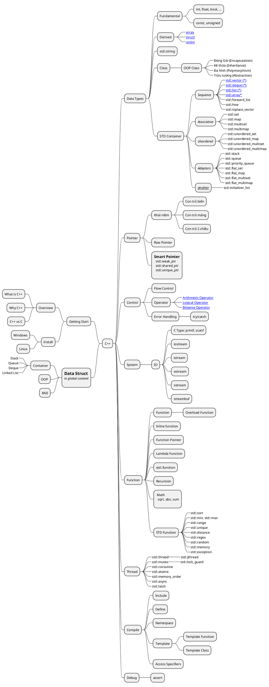

# \[C++\] Overview

## Roadmap


## Roadmap

```puml
@startwbs
* Road Map C++

''''''''''''''''''''''''''''''''''''''''''''''''''''''''''''''''''''''''''''''''''''' Getting Start (Level_0)
** Getting Start
***_ Overview
****_ What is C++
****_ Why C++
****_ C++ vs C
***_ Cài Đặt
****:=== Windows
  Compiler: gcc, g++
  Tools: msys, vscode
;
****:=== Linux
  Compiler: gcc, g++
  Tools: vscode, any text editor
;
***_ Hello World


''''''''''''''''''''''''''''''''''''''''''''''''''''''''''''''''''''''''''''''''''''' Level_1
** Level_1
***:== Data Types (Kiểu Biến)
====
-- Fundamental --
  int, float, bool, ...
  const
  unsigned
-- Derived --
  array
  struct
  union
----
  enum
-- Chuỗi --
  std::string
  khởi tạo
  const char*
  Spec. char
    /n, /r, /t, /0...
-- namespace --
;
***:== Operator
  [[/Programming/cpp/cpp-arithmetic-operator/ Arithmetic Operator]] (+,-,*,/,%, ...)
  [[/Programming/cpp/cpp-logical-operator/ Logical Operator]] (&,|,^,~, ...)
  [[/Programming/cpp/cpp-bit-operator/ Bitswise Operator]] (&,|,>>,<<, ...)
;
***:== [[/Programming/cpp/cpp-pointer/ Pointer]]
-- Kiến thức --
    Khái Niệm, Địa chỉ và
    Hướng dẫn sử dụng
  Khai báo
  nullptr
  delete
;
***:== Common
  Memory Model
    heap, stack, ...
  Khái niệm Thùng Chứa
    Stack, Queue
    Linked List
;
***:=== Control
  if/else, switch, for, ...
;
***:=== Function
  Khái niệm
  main
  hàm chức năng
;
***:== System
-- IO --
    printf, scanf
    std::cout, std::endl
-- System --
  system
;

''''''''''''''''''''''''''''''''''''''''''''''''''''''''''''''''''''''''''''''''''''' Level_2
** Level_2
***:=== Data Types
  - Type Cast
*** Size of Types
*** Giới hạn
-- strings --
  size, capacity, ...
  string cast
  cast to string
  export
;
****(Class):=== Derived
  Class
;
****:=== STD Container
  Khái Niệm, giới thiệu
;
***(Access_Specifiers):== Compile
  Access Specifiers
  Include
    File
    Lib
;
***:=== Function
  - main(int argc, char** args)
  - overload function
;
***:=== Pointer
  Con trỏ và chuỗi
  Con trỏ đa chiều
;
*** Thư viện STD
****:== STD Container
== adaptors ==
  **[[/Programming/cpp/cpp-std-stack std::stack]]**
  **[[/Programming/cpp/cpp-std-queue std::queue]]**
== sequence ==
  **[[/Programming/cpp/cpp-std-array std::array]]**
  **[[/Programming/cpp/cpp-std-vector std::vector]]**
  **[[/Programming/cpp/cpp-std-list std::list]]**
  **[[/Programming/cpp/cpp-std-deque std::deque]]**
;
----:== STD Function
  std::sort
  std::min, std::max
  std::find
;
****:== math
  sum
  sqrt
  abs
;

''''''''''''''''''''''''''''''''''''''''''''''''''''''''''''''''''''''''''''''''''''' Level_3
** Level_3
***:=== Commmon
  Memory Leak
;
***:=== Data Types
****:=== Derived
  OOP Class
;
***:=== Data Types
  - Auto Type
  - Static Cast
  - Dynamic Cast
-- strings --
  - cắt chuỗi
  - chuỗi con
  - Tìm kiếm phần tử
;
*** Pointer
**** Raw Pointer
****:== Smart Pointer
 std::weak_ptr
 std::shared_ptr
 std::unique_ptr
;
*** Thư Viện STD
****:== STD Container
-- associative --
  **std::set**
  **std::map**
  std::multiset
  std::multimap
-- u_associative --
  **std::unordered_set**
  **std::unordered_map**
  std::unordered_multiset
  std::unordered_multimap
-- adaptors --
  std::priority_queue
  std::flat_set
  std::flat_map
  std::flat_multiset
  std::flat_multimap
;
***:== Compile
  Define
  Namespace
  Marcro funtion
;
***:== Thread
  std::thread
    std::jthread
  std::mutex
  std::coroutine
;
***:== Function
  Lambda Function
  Function as Parameter
  Function Pointer
  inline function
  Recursion
;

''''''''''''''''''''''''''''''''''''''''''''''''''''''''''''''''''''''''''''''''''''' Level_4
** Level_4
*** Compile
**+*:== Template
  Template Class
  Template Function
;
***:=== System
  IO
    std::flush
    std::wcout, std::wcin
    std::cerr, std::clog
;
***:== Data Types
-- Types --
  utility, tuple, pair
-- Cast --
  const_cast
  reinterpret_cast
;
***:== Control
  try/catch
  throw error
  error handling
      error data
      error null
      error empty string
;
***:== System
  Date Time
  Time processing
;
***:== Thread
  std::lock_guard
;
*** Thư Viện STD
----:== STD Function
  std::range
  std::unique
  std::distance
;

''''''''''''''''''''''''''''''''''''''''''''''''''''''''''''''''''''''''''''''''''''' Level_5
** Level_5
***:== Data Types
  mutable
  volatile
;
***:== Thread
  std::lock_guard
  std::atomic
  std::memory_order
  std::async
  std::latch
;
*** Inline assembly

** Opt
*** Thư Viện STD
****:== STD Container
  std::initializer_list
;
***:== UserDefined
-- overwrite std::cout --
  print
  println
;
***:== System
-- IO lib --
  **iostream**
  **istream**
  **ostream**
  **sstream**
  **streambuf**
;
***:== Function
  std::regex
  std::random
  std::memory
  std::exception
;

''''''''''''''''''''''''''''''''''''''''''''''''''''''''''''''''''''''''''''''''''''' Level_6
** Level_6

Class -> Access_Specifiers
@endwbs
```

<!--
[[/Programming/cpp/cpp-linear-types/ std::linear Types]]
-->