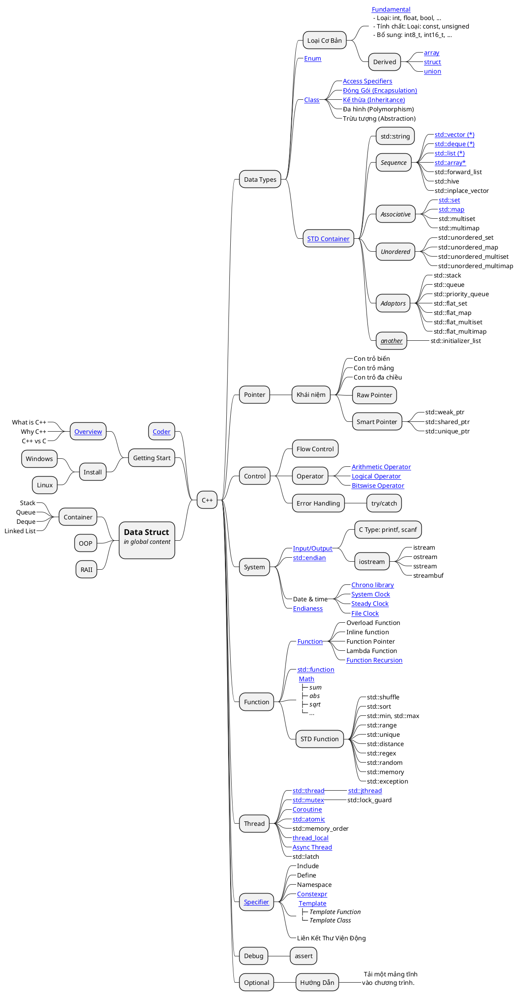

# \[C++\] Overview

## Roadmap

```puml
@startmindmap
skinparam backgroundcolor transparent
!$URL = "http://localhost:65002/Programming/cpp"

* C++

left side
** [[http://localhost:65002/ Coder]]
** Getting Start
*** [[$URL/cpp-overview Overview]]
****_ What is C++
****_ Why C++
****_ C++ vs C
*** Install
**** Windows
**** Linux
**:= Data Struct
//in global content//
;
*** Container
****_ Stack
****_ Queue
****_ Deque
****_ Linked List
*** OOP
*** RAII

right side
** Data Types
*** Loại Cơ Bản
****_: [[$URL/cpp-fundamental-datatypes/ Fundamental]]
  - Loại: int, float, bool, ...
  - Tính chất: Loại: const, unsigned
  - Bổ sung: int8_t, int16_t, ...
;
**** Derived
*****_ [[$URL/cpp-array/ array]]
*****_ [[$URL/cpp-struct/ struct]]
*****_ [[$URL/cpp-union/ union]]
***_ [[$URL/cpp-enum/ Enum]]
***_ [[$URL/cpp-class/ Class]]
****_ [[$URL/cpp-class-access-specifiers/ Access Specifiers]]
****_ [[$URL/cpp-class-encapsulation/ Đóng Gói (Encapsulation)]]
****_ [[$URL/cpp-class-inheritance/ Kế thừa (Inheritance)]]
****_ Đa hình (Polymorphism)
****_ Trừu tượng (Abstraction)
*** [[$URL/cpp-std-container/ STD Container]]
**** std::string
**** //Sequence//
*****_ [[$URL/cpp-std-vector/ std::vector (*)]]
*****_ [[$URL/cpp-std-deque/ std::deque (*)]]
*****_ [[$URL/cpp-std-list/ std::list (*)]]
*****_ [[$URL/cpp-std-array/ std::array*]]
*****_ std::forward_list
*****_ std::hive
*****_ std::inplace_vector
**** //Associative//
*****_ [[$URL/cpp-std-set std::set]]
*****_ [[$URL/cpp-std-map std::map]]
*****_ std::multiset
*****_ std::multimap
**** //Unordered//
*****_ std::unordered_set
*****_ std::unordered_map
*****_ std::unordered_multiset
*****_ std::unordered_multimap
**** //Adaptors//
*****_ std::stack
*****_ std::queue
*****_ std::priority_queue
*****_ std::flat_set
*****_ std::flat_map
*****_ std::flat_multiset
*****_ std::flat_multimap
**** //__another__//
*****_ std::initializer_list

** Pointer
*** Khái niệm
****_ Con trỏ biến
****_ Con trỏ mảng
****_ Con trỏ đa chìều
**** Raw Pointer
**** Smart Pointer
*****_ std::weak_ptr
*****_ std::shared_ptr
*****_ std::unique_ptr

** Control
*** Flow Control
*** Operator
****_ [[$URL/cpp-arithmetic-operator/ Arithmetic Operator]]
****_ [[$URL/cpp-logical-operator/ Logical Operator]]
****_ [[$URL/cpp-bit-operator/ Bitswise Operator]]
*** Error Handling
**** try/catch

** System
***_ [[$URL/cpp-input-output/ Input/Output]]
**** C Type: printf, scanf
**** iostream
*****_ istream
*****_ ostream
*****_ sstream
*****_ streambuf
***_ [[$URL/cpp-std-endian/ std::endian]]
***_ Date & time
****_ [[$URL/cpp-std-chrono-library/ Chrono library]]
****_ [[$URL/cpp-system-system-clock/ System Clock]]
****_ [[$URL/cpp-system-steady-clock/ Steady Clock]]
****_ [[$URL/cpp-system-file-clock/ File Clock]]
***_ [[$URL/cpp-std-endian/ Endianess]]
** Function
***_ [[$URL/cpp-function/ Function]]
****_ Overload Function
****_ Inline function
****_ Function Pointer
****_ Lambda Function
****_ [[$URL/cpp-function-recursion/ Function Recursion]]
***_ [[$URL/cpp-function-as-parameter/ std::function]]
***_: [[$URL/cpp-math/ Math]]
  ├─ //sum//
  ├─ //abs//
  ├─ //sqrt//
  └─ //...//
;
*** STD Function
****_ std::shuffle
****_ std::sort
****_ std::min, std::max
****_ std::range
****_ std::unique
****_ std::distance
****_ std::regex
****_ std::random
****_ std::memory
****_ std::exception

** Thread
***_ [[$URL/cpp-std-thread/ std::thread]]
****_ [[$URL/cpp-std-jthread/ std::jthread]]
***_ [[$URL/cpp-std-mutex/ std::mutex]]
****_ std::lock_guard
***_ [[$URL/cpp-coroutine/ Coroutine]]
***_ [[$URL/cpp-std-atomic/ std::atomic]]
***_ std::memory_order
***_ [[$URL/cpp-std-thread_local/ thread_local]]
***_ [[$URL/cpp-std-async-thread/ Async Thread]]
***_ std::latch

** [[$URL/cpp-specifier/ Specifier]]
***_ Include
***_ Define
***_ Namespace
***_ [[$URL/cpp-constexpr/ Constexpr]]
***_: [[$URL/cpp-template/ Template]]
  ├─ //Template Function//
  └─ //Template Class//
;
***_ Liên Kết Thư Viện Động

** Debug
*** assert

** Optional
*** Hướng Dẫn
****_: Tải một mảng tĩnh
vào chương trình.
;
@endendmindmap
```

<!-- Hidding -->

- [C++ Overview](cpp-overview.md)

