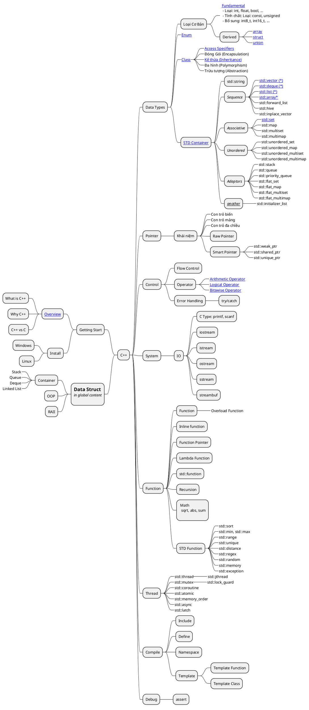

# \[C++\] Overview

## Roadmap

```puml
@startmindmap

* C++

left side
** Getting Start
*** [[/Programming/cpp/cpp-overview Overview]]
**** What is C++
**** Why C++
**** C++ vs C
*** Install
**** Windows
**** Linux
**:= Data Struct
//in global content//
;
*** Container
****_ Stack
****_ Queue
****_ Deque
****_ Linked List
*** OOP
*** RAII

right side
** Data Types
*** Loại Cơ Bản
****_: [[/Programming/cpp/cpp-fundamental-datatypes/ Fundamental]]
  - Loại: int, float, bool, ...
  - Tính chất: Loại: const, unsigned
  - Bổ sung: int8_t, int16_t, ...
;
**** Derived
*****_ [[/Programming/cpp/cpp-array/ array]]
*****_ [[/Programming/cpp/cpp-struct/ struct]]
*****_ [[/Programming/cpp/cpp-union/ union]]
***_ [[/Programming/cpp/cpp-enum/ Enum]]
***_ [[/Programming/cpp/cpp-class/ Class]]
****_ [[/Programming/cpp/cpp-class-access-specifiers/ Access Specifiers]]
****_ Đóng Gói (Encapsulation)
****_ [[/Programming/cpp/cpp-class-inheritance/ Kế thừa (Inheritance)]]
****_ Đa hình (Polymorphism)
****_ Trừu tượng (Abstraction)
*** [[/Programming/cpp/cpp-std-container/ STD Container]]
**** std::string
**** //Sequence//
*****_ [[/Programming/cpp/cpp-std-vector/ std::vector (*)]]
*****_ [[/Programming/cpp/cpp-std-deque/ std::deque (*)]]
*****_ [[/Programming/cpp/cpp-std-list/ std::list (*)]]
*****_ [[/Programming/cpp/cpp-std-array/ std::array*]]
*****_ std::forward_list
*****_ std::hive
*****_ std::inplace_vector
**** //Associative//
*****_ [[/Programming/cpp/cpp-std-set std::set]]
*****_ std::map
*****_ std::multiset
*****_ std::multimap
**** //Unordered//
*****_ std::unordered_set
*****_ std::unordered_map
*****_ std::unordered_multiset
*****_ std::unordered_multimap
**** //Adaptors//
*****_ std::stack
*****_ std::queue
*****_ std::priority_queue
*****_ std::flat_set
*****_ std::flat_map
*****_ std::flat_multiset
*****_ std::flat_multimap
**** //__another__//
*****_ std::initializer_list

** Pointer
*** Khái niệm
****_ Con trỏ biến
****_ Con trỏ mảng
****_ Con trỏ đa chìều
**** Raw Pointer
**** Smart Pointer
*****_ std::weak_ptr
*****_ std::shared_ptr
*****_ std::unique_ptr

** Control
*** Flow Control
*** Operator
****_ [[/Programming/cpp/cpp-arithmetic-operator/ Arithmetic Operator]]
****_ [[/Programming/cpp/cpp-logical-operator/ Logical Operator]]
****_ [[/Programming/cpp/cpp-bit-operator/ Bitswise Operator]]
*** Error Handling
**** try/catch
** System
*** IO
**** C Type: printf, scanf
**** iostream
**** istream
**** ostream
**** sstream
**** streambuf

** Function
*** Function
****_ Overload Function
*** Inline function
*** Function Pointer
*** Lambda Function
*** std::function
*** Recursion
***: Math
  sqrt, abs, sum
;
*** STD Function
****_ std::sort
****_ std::min, std::max
****_ std::range
****_ std::unique
****_ std::distance
****_ std::regex
****_ std::random
****_ std::memory
****_ std::exception

** Thread
***_ std::thread
****_ std::jthread
***_ std::mutex
****_ std::lock_guard
***_ std::coroutine
***_ std::atomic
***_ std::memory_order
***_ std::async
***_ std::latch
** Compile
*** Include
*** Define
*** Namespace
*** Template
**** Template Function
**** Template Class
** Debug
*** assert
@endendmindmap
```
<!--
[[/Programming/cpp/cpp-linear-types/ std::linear Types]]
-->