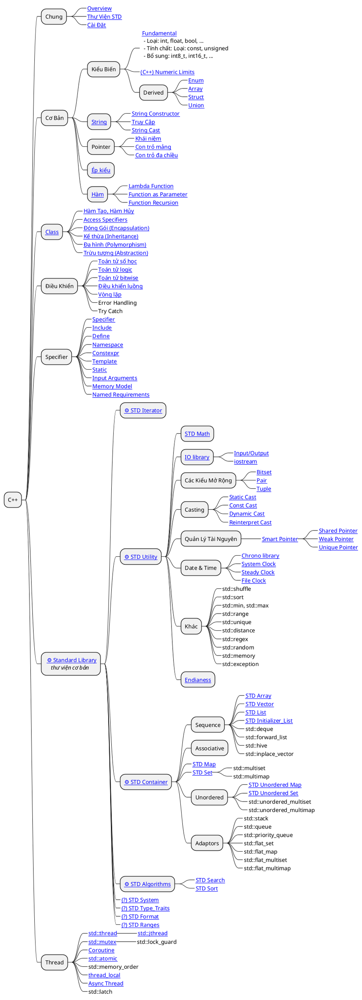

# C++

## Roadmap

<!-- ***_ Container: Programming/cpp/cpp-container.md
***_ Linked List: Programming/cpp/cpp-linked-list.md -->

```puml
@startmindmap
skinparam backgroundcolor transparent
!$URL = "/Programming/cpp"

* C++

** Chung
***_ [[$URL/cpp-overview Overview]]
***_ [[$URL/cpp-std Thư Viện STD]]
***_ [[$URL/cpp-install Cài Đặt]]

** Cơ Bản
*** Kiểu Biến
****_: [[$URL/cpp-fundamental-datatypes/ Fundamental]]
  - Loại: int, float, bool, ...
  - Tính chất: Loại: const, unsigned
  - Bổ sung: int8_t, int16_t, ...
;
****_ [[$URL/cpp-std-numeric-limits/ (C++) Numeric Limits]]
**** Derived
*****_ [[$URL/cpp-enum/ Enum]]
*****_ [[$URL/cpp-array/ Array]]
*****_ [[$URL/cpp-struct/ Struct]]
*****_ [[$URL/cpp-union/ Union]]
*** [[$URL/cpp-std-string String]]
****_ [[$URL/cpp-string-construct-deconstruct String Constructor]]
****_ [[$URL/cpp-string-index Truy Cập]]
****_ [[$URL/cpp-string-cast String Cast]]
*** Pointer
****_ [[$URL/cpp-pointer Khái niệm]]
****_ [[$URL/cpp-pointer-array Con trỏ mảng]]
****_ [[$URL/cpp-dimension-array-pointer Con trỏ đa chìều]]
*** [[$URL/cpp-fundamental-cast Ép kiểu]]
*** [[$URL/cpp-function Hàm]]
****_ [[$URL/cpp-lambda-function Lambda Function]]
****_ [[$URL/cpp-function-as-parameter Function as Parameter]]
****_ [[$URL/cpp-function-recursion Function Recursion]]

** [[$URL/cpp-class/ Class]]
***_ [[$URL/cpp-class-constructor-destructor-function Hàm Tạo, Hàm Hủy]]
***_ [[$URL/cpp-class-access-specifiers/ Access Specifiers]]
***_ [[$URL/cpp-class-encapsulation/ Đóng Gói (Encapsulation)]]
***_ [[$URL/cpp-class-inheritance/ Kế thừa (Inheritance)]]
***_ [[$URL/cpp-class-polymorphism Đa hình (Polymorphism)]]
***_ [[$URL/cpp-class-abstraction Trừu tượng (Abstraction)]]

** Điều Khiển
***_ [[$URL/cpp-arithmetic-operator Toán tử số học]]
***_ [[$URL/cpp-logical-operator Toán tử logic]]
***_ [[$URL/cpp-bit-operator Toán tử bitwise]]
***_ [[$URL/cpp-flow-control Điều khiển luồng]]
***_ [[$URL/cpp-loop Vòng lặp]]
***_ Error Handling
***_ Try Catch

** Specifier
***_ [[$URL/cpp-specifier Specifier]]
***_ [[$URL/cpp-include Include]]
***_ [[$URL/cpp-define Define]]
***_ [[$URL/cpp-namespace Namespace]]
***_ [[$URL/cpp-constexpr Constexpr]]
***_ [[$URL/cpp-template Template]]
***_ [[$URL/cpp-static Static]]
***_ [[$URL/cpp-command-line-arguments Input Arguments]]
***_ [[$URL/cpp-memory-model Memory Model]]
***_ [[$URL/cpp-named-requirements Named Requirements]]

**: [[$URL/cpp-std-standard-library ⚙️ Standard Library]]
    //thư viện cơ bản//;
*** [[$URL/cpp-std-iterators ⚙️ STD Iterator]]
*** [[$URL/cpp-std-utility ⚙️ STD Utility]]
**** [[$URL/cpp-std-math STD Math]]
**** [[$URL/cpp-std-math IO library]]
*****_ [[$URL/cpp-input-output Input/Output]]
*****_ [[$URL/cpp-std-iostream iostream]]
**** Các Kiểu Mở Rộng
*****_ [[$URL/cpp-std-bitset Bitset]]
*****_ [[$URL/cpp-std-pair Pair]]
*****_ [[$URL/cpp-std-tuple Tuple]]
**** Casting
*****_ [[$URL/cpp-static_cast Static Cast]]
*****_ [[$URL/cpp-const_cast Const Cast]]
*****_ [[$URL/cpp-dynamic_cast Dynamic Cast]]
*****_ [[$URL/cpp-reinterpret_cast Reinterpret Cast]]
**** Quản Lý Tài Nguyên
*****_ [[$URL/cpp-smart-pointer Smart Pointer]]
******_ [[$URL/cpp-shared-ptr Shared Pointer]]
******_ [[$URL/cpp-weak-ptr Weak Pointer]]
******_ [[$URL/cpp-unique-ptr Unique Pointer]]
**** Date & Time
*****_ [[$URL/cpp-std-chrono-library Chrono library]]
*****_ [[$URL/cpp-system-system-clock System Clock]]
*****_ [[$URL/cpp-system-steady-clock Steady Clock]]
*****_ [[$URL/cpp-system-file-clock File Clock]]
**** Khác
*****_ std::shuffle
*****_ std::sort
*****_ std::min, std::max
*****_ std::range
*****_ std::unique
*****_ std::distance
*****_ std::regex
*****_ std::random
*****_ std::memory
*****_ std::exception
**** [[$URL/cpp-std-endian Endianess]]
*** [[$URL/cpp-std-container ⚙️ STD Container]]
**** Sequence
*****_ [[$URL/cpp-std-array STD Array]]
*****_ [[$URL/cpp-std-vector STD Vector]]
*****_ [[$URL/cpp-std-list STD List]]
*****_ [[$URL/cpp-initializer-list STD Initializer_List]]
*****_ std::deque
*****_ std::forward_list
*****_ std::hive
*****_ std::inplace_vector
**** Associative
****_ [[$URL/cpp-std-map STD Map]]
****_ [[$URL/cpp-std-set STD Set]]
*****_ std::multiset
*****_ std::multimap
**** Unordered
*****_ [[$URL/cpp-std-unordered-map STD Unordered Map]]
*****_ [[$URL/cpp-std-unordered-set STD Unordered Set]]
*****_ std::unordered_multiset
*****_ std::unordered_multimap
**** Adaptors
*****_ std::stack
*****_ std::queue
*****_ std::priority_queue
*****_ std::flat_set
*****_ std::flat_map
*****_ std::flat_multiset
*****_ std::flat_multimap
*** [[$URL/cpp-std-algorithms ⚙️ STD Algorithms]]
****_ [[$URL/cpp-std-algorithms-search STD Search]]
****_ [[$URL/cpp-std-algorithms-sort STD Sort]]
***_ [[$URL/cpp-std-system (?) STD System]]
***_ [[$URL/cpp-std-type_traits (?) STD Type_Traits]]
***_ [[$URL/cpp-std-format (?) STD Format]]
***_ [[$URL/cpp-std-ranges (?) STD Ranges]]

** Thread
***_ [[$URL/cpp-std-thread/ std::thread]]
****_ [[$URL/cpp-std-jthread/ std::jthread]]
***_ [[$URL/cpp-std-mutex/ std::mutex]]
****_ std::lock_guard
***_ [[$URL/cpp-coroutine/ Coroutine]]
***_ [[$URL/cpp-std-atomic/ std::atomic]]
***_ std::memory_order
***_ [[$URL/cpp-std-thread_local/ thread_local]]
***_ [[$URL/cpp-std-async-thread/ Async Thread]]
***_ std::latch

@endmindmap
```

<!-- Hidding -->

- [C++ Overview](cpp-overview.md)

