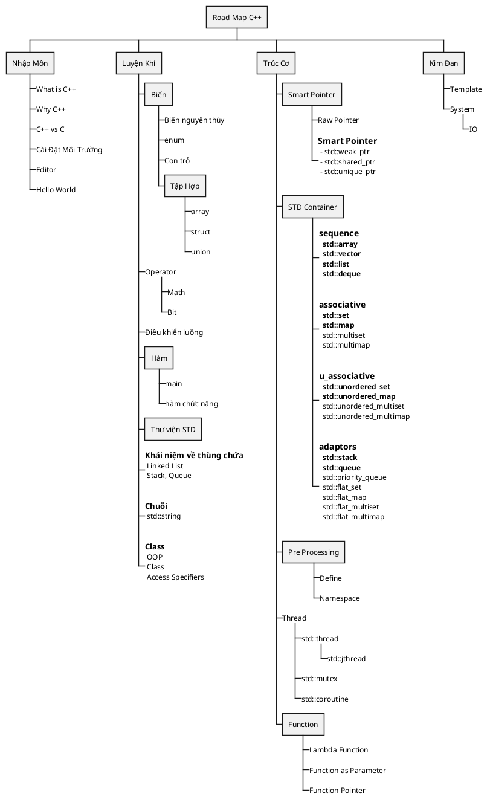

# \[C++\] Overview

Tìm cách đặt tên các cấp bậc Basic, Begin, ... mệt vl nên đổi cấp bậc này xài cho dễ hiểu

- Nhập Môn
- Luyện Khí
- Trúc Cơ
- Kim Đan
- Nguyên Anh
- Hóa Thần

<!--
[[/Programming/cpp/cpp-linear-types/ std::linear Types]]
-->niệm