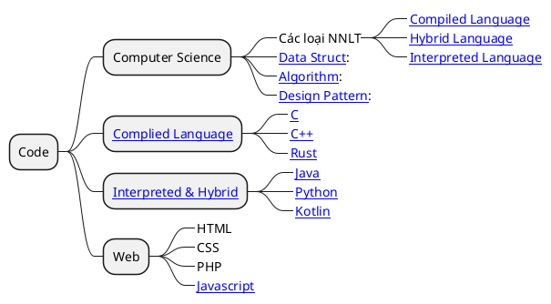

# Coder

Hướng tới mục tiêu trở thành lập trình viên xịn xò.

## Map

```puml
@startmindmap
skinparam backgroundcolor transparent
!$URL = "/Programming"

* Code

** Computer Science
***_ Các loại NNLT
****_ [[$URL/compiled-language/ Compiled Language]]
****_ [[$URL/hybrid-language/ Hybrid Language]]
****_ [[$URL/interpreted-language/ Interpreted Language]]
***_ [[$URL/CS/data-struct/ Data Struct]]:
***_ [[$URL/CS/algorithm-overview/ Algorithm]]:
***_ [[$URL/CS/design-pattern/ Design Pattern]]:

** [[$URL/compiled-language Complied Language]]
***_ [[$URL/c/c/ C]]
***_ [[$URL/cpp/cpp/ C++]]
***_ [[$URL/Rust/rust/ Rust]]
** [[$URL/interpreted-hybrid-language Interpreted & Hybrid]]
***_ [[$URL/Java/java/ Java]]
***_ [[$URL/python/python/ Python]]
***_ [[$URL/Kotlin/kotlin/ Kotlin]]

** Web
***_ HTML
***_ CSS
***_ PHP
***_ [[$URL/Javascript/javascript Javascript]]

@endmindmap
```