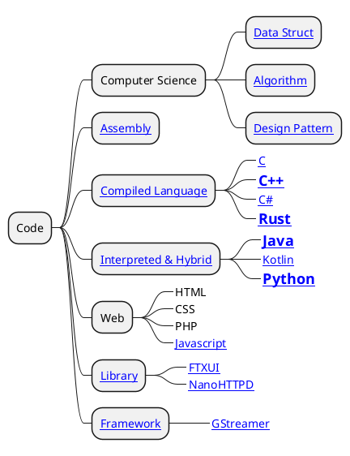

# Coder

Hướng tới mục tiêu trở thành lập trình viên xịn xò.

## Map

- [Library](./Library/library.md)
- [Framework](./Frameworks/frameworks.md)
- [Assembly](./Programming/assembly/assembly.md)
- [Compiled Language](./Programming/compiled-language.md)
- [Interpreted & Hybrid](./Programming/interpreted-hybrid-language.md)

