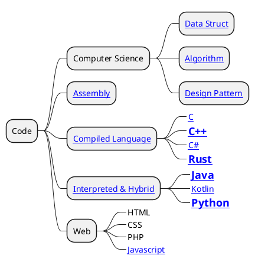

# Tad Code

Hướng tới mục tiêu trở thành lập trình viên xịn xò.

## Map Of Content

- [Library](./Library/library.md)
- [Framework](./Frameworks/frameworks.md)
- [Assembly](./Programming/assembly/assembly.md)
- [Compiled Language](./Programming/compiled-language.md)
- [Interpreted & Hybrid](./Programming/interpreted-hybrid-language.md)

## Note

Có ba phần cần phải phân bổ lại

1. Phân bổ trên Begin/Start/Guide:
    - Hướng dẫn tổng quan về cái này là cái gì? Làm như thế nào? Để làm gì?
    - Hướng dẫn tổng quan về làm gì, làm như thế nào? Nó là cái gì.
    - Bài hướng dẫn ở đây hướng đến mục đích **làm cho thứ gì đó hoạt động được**, không nhằm mục đích giải thích.
    - Đôi khi sẽ có một số chú thích nhỏ không đáng kể.
1. Tài liệu
    - Tài liệu trình bày bổ sung về các phần. Nó nói rõ hơn và giải thích cụ thể hơn.
    - Mình nghĩ nên để dạng bài ngắn như **Hiểu về abc ...**
    - Mục đích của phần này là nắm được bản chất và các hàm, chức năng.
1. Phân Bổ Hướng Dẫn
    - Hướng dẫn trong các trường hợp, dự án cụ thể.
    - Các bài hướng dẫn sẽ trả lời cho một vài vấn đề và giải quyết vấn đề.